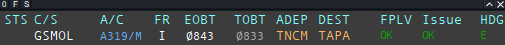
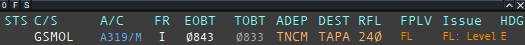
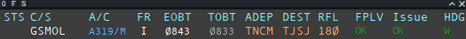
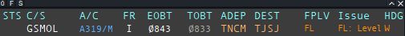

# FPLV (EuroScope Flight Plan Validator)

[Download latest FPLV.dll built](https://github.com/Quales/FPLV/releases/latest)
[Download latest FPLV.dll release](https://github.com/Quales/FPLV/releases/latest/download/FPLV.dll)

FPLV is a EuroScope plugin that validates flight plans against configurable rules (RVSM, direction, flight level parity, altitude range) and displays results directly in a custom flight plan list.

## What it does

- Loads rules from `FPLV_rules.json` located next to the plugin DLL.
- Evaluates each flight plan and outputs:
  - **Status** (`OK`, `FL`, `ERR`, `N/A`)
  - **Direction** (e.g. `W`, `E`, `N`, `S`, `??`)
  - **Issues** (compact or detailed)
- Colors list values:
  - Green: valid (`OK`)
  - Orange: single FL-related issue
  - Red: multiple/other errors
- Supports runtime debug messages for per-rule evaluation tracing.

## Screenshots

Columns are as follows in my configuration : FPLV status / FPLV issues /  FPLV direction

- Status column will display OK, FL, ERR
- Issue column will display the issue
- Direction column will display the direction of the flight

### From TNCM to TAPA, going east, should have an odd flight level. 230 is correct



### From TNCM to TAPA, going east, should have an odd flight level. 240 is incorrect



### From TNCM to TJSJ, going west, should have an even flight level. 180 is correct



### From TNCM to TJSJ, going west, should have an even flight level. 170 is incorrect



----

## Configuration file

### Example config

```json
{
  "plugin_name": "FPLV",
  "list_name": "Flight plan validation",
  "debug_enabled": false,
  "columns": [
    { "code": "status", "title": "VAL", "width": 6, "centered": true },
    { "code": "direction", "title": "DIR", "width": 8, "centered": true },
    { "code": "issues", "title": "ISSUES", "width": 18, "centered": false }
  ],
  "rules": [
    {
      "name": "Europe",
      "description": "Europe north/south RVSM rule",
      "filters": {
        "airports": ["LFPG", "LFBO"],
        "regex": ["^LF[A-Z]{2}$"]
      },
      "direction": {
        "north": "odd",
        "south": "even"
      },
      "enabled": true
    },
    {
      "name": "Caribbean",
      "description": "Caribbean east/west RVSM rule",
      "filters": {
        "airports": ["TNCC", "TNCM"],
        "regex": ["^TN[A-Z]{2}$"]
      },
      "direction": {
        "east": "odd",
        "west": "even"
      },
      "enabled": true
    },
    {
      "name": "Default",
      "description": "Fallback rule",
      "filters": {
        "regex": [".*"]
      },
      "direction": {
        "east": "odd",
        "west": "even"
      },
      "default": true,
      "enabled": true
    }
  ],
  "vfr_rules": []
}
```

## License

GNU GPLv3 (see file headers in source).
